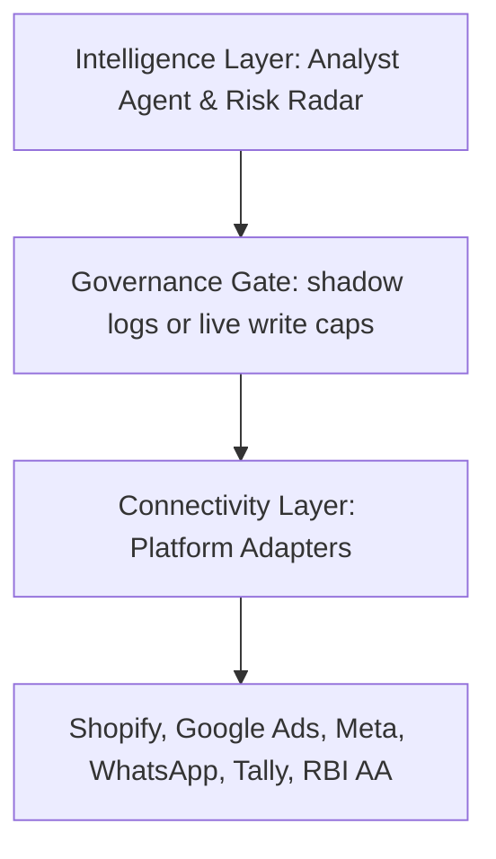

# Brand Digital Twin: Growth-as-a-Service (GaaS)

A unified, autonomous engine that orchestrates a brand's digital identity across commerce, marketing, messaging, and financial surfaces. Built with safety-critical governance, profit-aware optimization (POAS), and cross-platform ad stack migration.

---

## 1. System Architecture

The platform follows a modular, vendor-neutral design where all external surfaces are isolated behind standardized interfaces.



### Core Components
- **Unified Connectivity Layer (`platform_adapter.ts`)**: Defines the standardized read, execute, rollback, and health-check interface for external services.
- **POAS Margin Engine (`poas.sql`)**: Moves optimization metrics from superficial ROAS to true Contribution Margin and POAS.
- **Governance Engine (`governance_engine.ts`)**: Safety chokepoint wrapping all write-intents with:
  - *Hard Blast-Radius Caps*: Enforces daily dollar limits.
  - *Graduated Autonomy*: A 5-tier trust ledger mapping earned vs. required trust.
  - *Irreversibility Safeguards*: Bypasses autopilot to queue human confirmations for non-reversible actions (e.g. WhatsApp broadcasts).
  - *Post-Execution Verification*: Re-evaluates target states post-write and triggers self-healing rollbacks on failure.
- **Stack Migration Engine (`google_express.ts`)**: Translates non-Google ad entities (Meta campaign objectives, budget rules, audiences) to native Google Search and Performance Max campaigns.
- **Risk Radar (`risk_radar.ts`)**: Connects catalog inventory counts with marketing spend, automatically halting ad sets for stockout variants.

---

## 2. Directory Layout & File Registry

| File | Purpose |
|---|---|
| `platform_adapter.ts` | Shared base class/interface for adapters |
| `shopify_adapter.ts` | Extracts catalog, orders, and unit costs/COGS |
| `google_ads_adapter.ts` | Simulates campaign and ad group level edits |
| `meta_ads_adapter.ts` | Simulates budget scaling and ad state controls |
| `whatsapp_adapter.ts` | Handles broadcast alerts with hard delivery ceilings |
| `tally_adapter.ts` | Extracts accounting ledgers and balance sheet data |
| `rbi_aa_adapter.ts` | Connects bank statements for cash burn/runway computations |
| `governance_engine.ts` | Safety-critical control loop and rollback manager |
| `google_express.ts` | Meta-to-Google cross-platform campaign translator |
| `risk_radar.ts` | Automatic inventory ad-pause trigger |
| `onboarding_simulator.ts`| Interactive CLI onboarding setup flow |

---

## 3. Getting Started

### Local Setup
The codebase is structured under the `blaze` (or `bazel`) build target system:
```bash
# Build the entire package
blaze build //experimental/brand_twin:all

# Run all test suites (Shopify, Governance, Risk Radar, Migration)
blaze test //experimental/brand_twin:all
```

### Try the Interactive Onboarding Simulator
To test the 4-step progressive onboarding UX flow, launch the interactive setup wizard:
```bash
blaze run //experimental/brand_twin:onboarding_simulator
```
*This simulates storefront audit scanning, credentials authorization, guardrail limit definitions, and shadow twin insight activation.*
